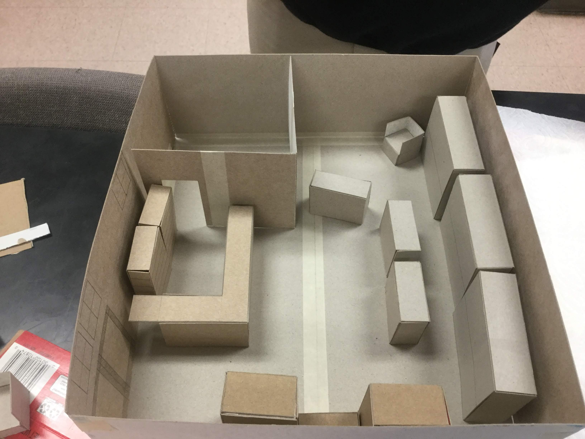
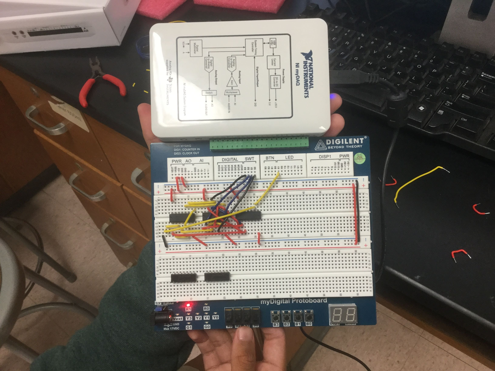
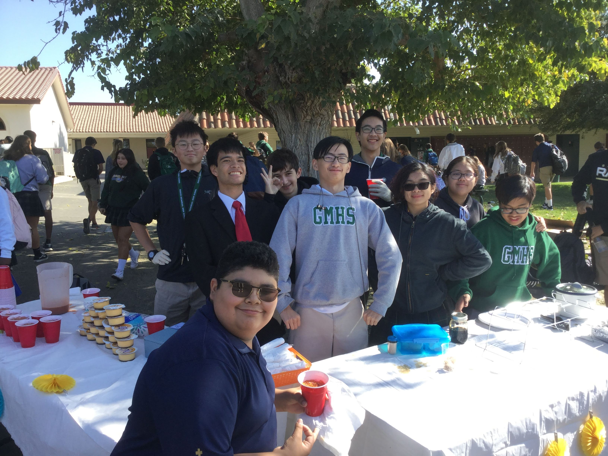
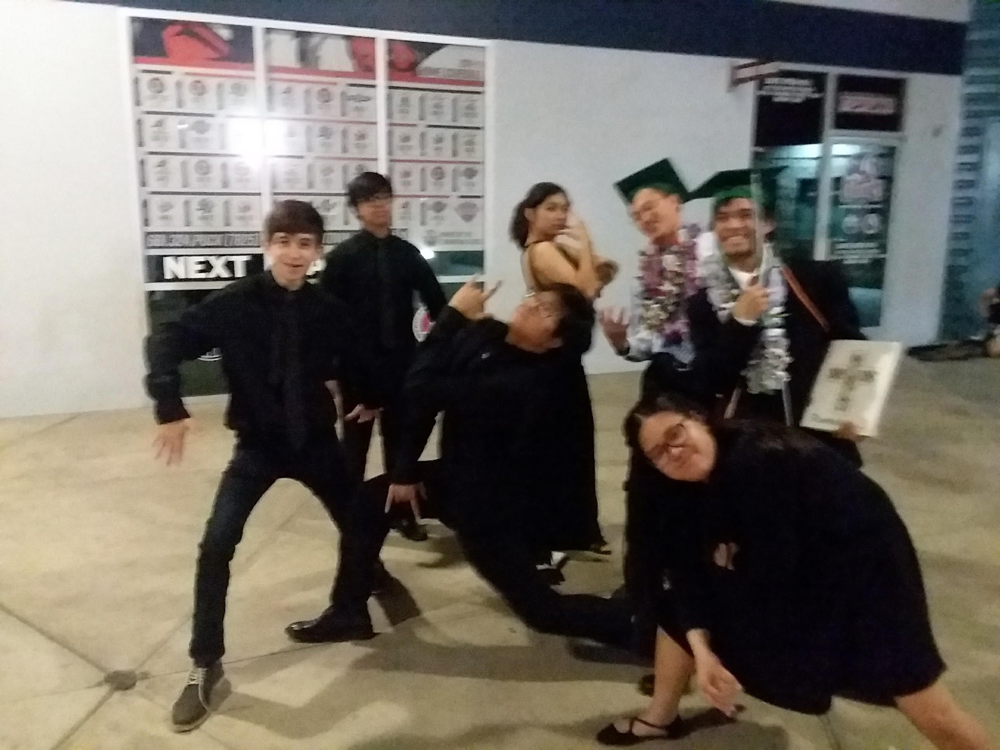
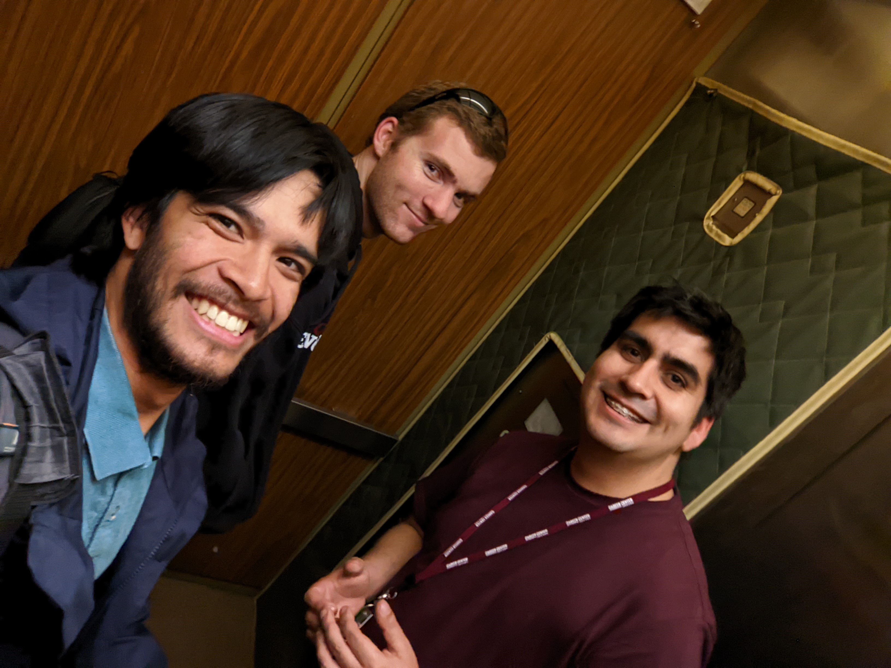
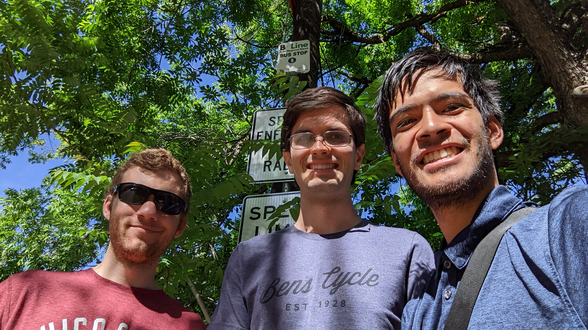
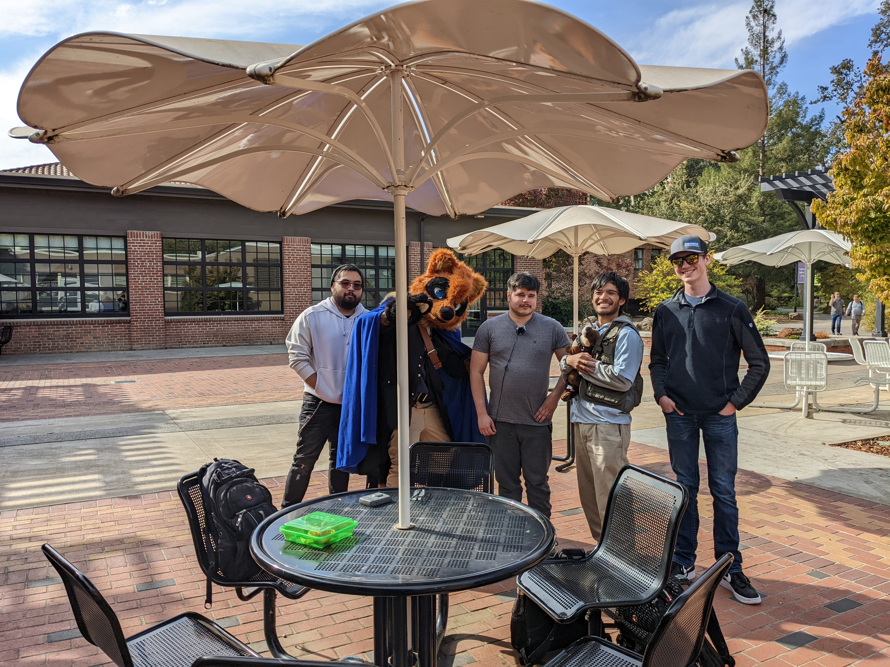
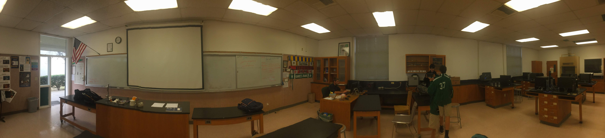

<!--

TOGGLE PREVIEW IN VISUAL STUDIO CODE:
    Ctrl + Shift + V

This space is designated for Markdown resources:
    - General Markdown Documentation: https://markdown-guide.readthedocs.io/en/latest/index.html

    - Markdown in Visual Studio Code Documentation: https://code.visualstudio.com/docs/languages/markdown

-->

[Comment]: <> (Inline Comment)
[//]: <> (This is also a comment)
[//]: # (This is also a comment)
<!--
    This is a multiline comment
-->

# Introduction
- Garces Memorial High School (August 2015 - May 2019)
    - Project Lead the Way (August 2015 - May 2019)
    - Garces Rambotics (August 2018 - May 2019)
    - Garces Gavel Club, Toastmaster International (August 2015 - May 2016, August 2017 - May 2019)
    <!--
    - Asian Culture Club
    - Rampage Newspaper
    - Garces Pep Band and Orchestra
    -->

Civil Engineering and Architecture | Electronic Circuits
--- | ---
 | 

- California State University, Chico
    - Major: Computer Engineering, Minor: Computer Science
    - Institute of Electrical and Electronics Engineers (IEEE) (August 2019 - Present)

[CSU Chico IEEE Homepage](https://site.ieee.org/sb-csuchico/)

[CSU Chico IEEE First General Meeting](https://site.ieee.org/sb-csuchico/2022/10/20/recap-1st-general-meeting-fall-2022/)

# Exercises
## Exercise 1
Given a sheet of US Letter Paper (8.5in x 11in) cut that sheet in such a way that you are able to fit two people within the sheet without the sheet itself tearing
- You cannot use any adhesives such as glue, tape, gum, etc.

## Exercise 2
With the given Circle Cutout and the paper with a square hole pass the circle through the square hole.
- Do not manipulate the circle before passing it through.
- Do not cut either paper

## Exercise 3
With the given paper figure reconstruct it using a half sheet of US Letter Paper (8.5in x 11in)

# What is Engineering?
A lot of engineering is problems, so what is it about?

- I consider it to be a means to finding to the ``solutions`` to the many problems people encounter.

Take the following for example:

What is the solution to the expression below?

$$
\begin{align*}
1 &+ 3
\end{align*}
$$

Trivial. The answer is of course 4

$$
\begin{align*}
1 + 3 &= 4
\end{align*}
$$

But it is not wrong to the following either:

$$
\begin{align*}
1 + 3 &= 2 + 2\\
&= 1 + 1 + 1 + 1\\
&= 2 \cdot 2!\\
&= \sqrt{4} \cdot \sqrt{4}\\
&= 2^2 \cdot \frac{9}{9}
\end{align*}
$$

# Find Solutions, not Answers
- There is always more than one way to reach a solution your job is to figure out what that solution is

# Be Adventurous
- Ask questions:
    - The hard ones, simple ones, and dumb ones
- The answer is not always apparent find unconventional solutions
- Make those mistakes
- Have hobbies, even if they are not related to your major

# Make Friends
- You will encounter **a lot** of people
    - Associate with people in and out of your field of study
    - Make friends with your teachers, instructors, and professors too!

. | .
--- | ---
 | 
 | 
 | 

# Here is an Image of the Very Room That you are in Right Now

